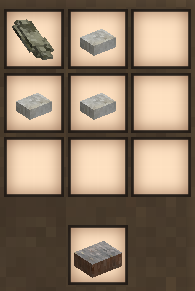
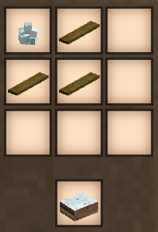

# RepairMe
#### A simple whetstone to restore durability a limited amount of times.

### Simple Craft


### Variant Craft


### Config

```json
{
  "WhetstoneDamageAsPercent": 5, // Damage the whetstone takes, calculated as percent from the total durability of the repaired tool
  "WhetstoneMinimumDamage": 10, // Flat minimum damage the whetstone will take if the %-result is below it
  "ToolRestoreAsPercent": 25 // Restored durability, calculated as percent from the total durability
}
```